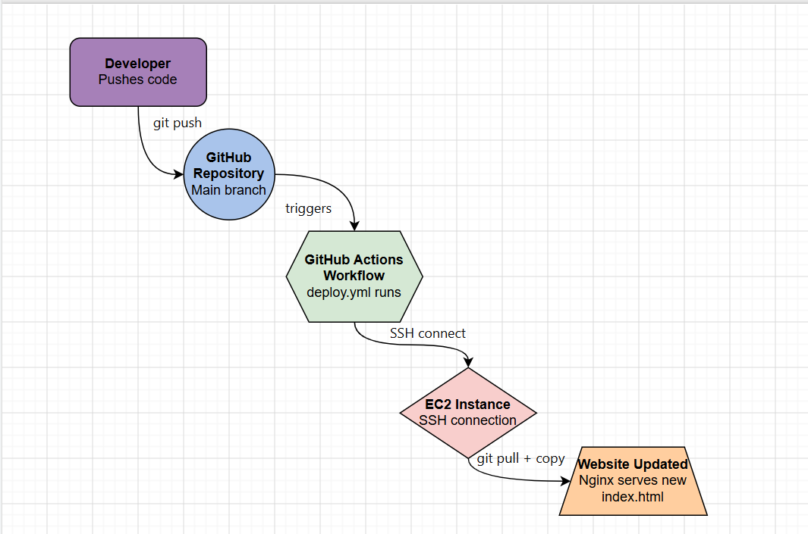
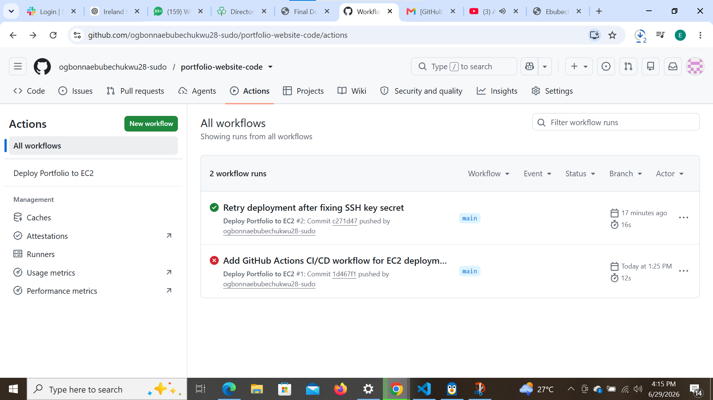
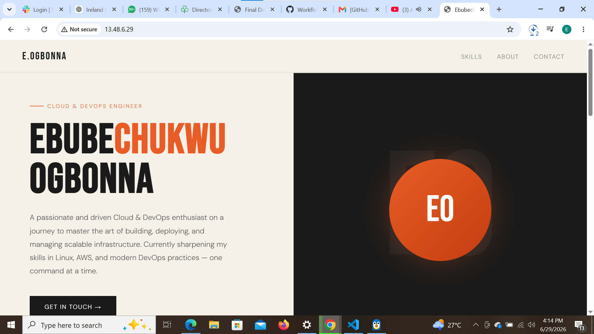

# Portfolio Website — CI/CD Pipeline with GitHub Actions

## CI/CD Flow Diagram

## Overview
This project automates the deployment of my portfolio website to an AWS EC2 instance using GitHub Actions. Whenever I push a change to the `main` branch, a GitHub Actions workflow automatically connects to my EC2 instance via SSH, pulls the latest code, and updates the live Nginx-served website — no manual deployment steps required.

## How It Works
The pipeline is triggered on every push to `main`. GitHub Actions uses the `appleboy/ssh-action` plugin to SSH into my EC2 instance using credentials stored securely as GitHub Secrets (`EC2_HOST`, `EC2_USERNAME`, `EC2_SSH_KEY`). Once connected, it runs a deployment script that navigates into the cloned repository on the server, pulls the latest changes with `git pull`, and copies the updated `index.html` into Nginx's web root (`/var/www/html`). The change is live within seconds of the push.

## Workflow File
The workflow is defined in `.github/workflows/deploy.yml` and runs on `ubuntu-latest`, using `actions/checkout` to check out the repo and `appleboy/ssh-action` to handle the SSH deployment step.

## Successful Workflow Run

## GitHub Secrets Used
- `EC2_HOST` — the EC2 instance's public IP
- `EC2_USERNAME` — the SSH login user (`ubuntu`)
- `EC2_SSH_KEY` — the private SSH key content used for authentication

## Live Site
http://13.48.6.29/

## Deployed Website

## Challenges and Solutions
Setting up authentication was the trickiest part of this project. Initial pushes failed with "refusing to allow a Personal Access Token to create or update workflow" because my token lacked the `workflow` scope — generating a new token with both `repo` and `workflow` checked resolved this. The first deployment attempt also failed with `ssh: no key found`, caused by an incorrectly copied private key in the `EC2_SSH_KEY` secret; re-copying the full key including the `BEGIN`/`END` lines fixed it. After both issues were resolved, the workflow ran successfully and deployed the site correctly — confirmed after a hard browser refresh, since the initial "unchanged" appearance was just browser caching.

## Lessons Learned
This project clarified how GitHub Secrets keep sensitive credentials out of version control while still letting automated workflows use them, and how SSH-based deployment actions work under the hood. I also learned the difference between Personal Access Token scopes and why `workflow` permissions are handled separately from general `repo` access — a distinction that wasn't obvious until I hit the actual error.

---

**Author:** Ebubechukwu Ogbonna
**Repository:** https://github.com/ogbonnaebubechukwu28-sudo/portfolio-website-code
